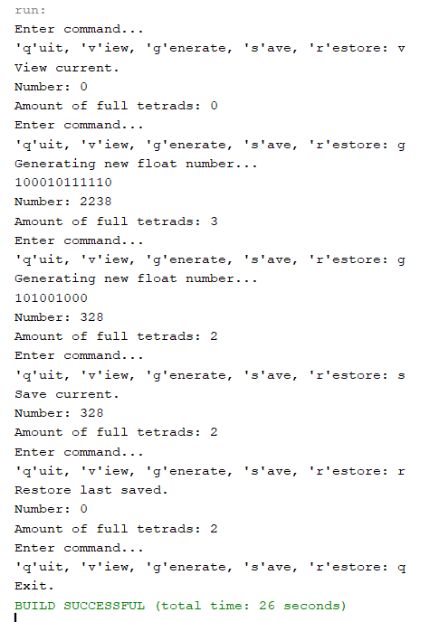

# Практика ООП

## Завдання 1 (01.03.24)

- Створити репозиторій
- Написати просту консольну програму

```java
        System.out.println("Task 1\nEnter something in console: ");
        Scanner scanner = new Scanner(System.in);
        String input = scanner.nextLine();
        System.out.println("Your input: " + input);
        scanner.close();
```

## Завдання 2 (04.03.24)

- Розробити клас, що серіалізується, для зберігання параметрів і результатів обчислень.
- Використовуючи агрегування, розробити клас для знаходження рішення задачі.

```java
package Task2;

import java.io.Serializable;

/**
 * Клас, що серіалізується, для зберігання параметрів і результатів обчислень
 * 
 * @author Киричок Софія
 */
public class Item2d implements Serializable{
    
    private static final long serialVersionUID = 1L;
    transient private float num;
    private int result;
    
    public Item2d(){
        num = .0f;
    }
    
    public Item2d(float num){ 
        this.num = num;
    }

    public float getNum() {
        return num;
    }

    public void setNum(float num) {
        this.num = num;
    }

    public int getResult() {
        return result;
    }

    public void setResult(int result) {
        this.result = result;
    }
    
    /**
     * @return Повертає строку з значеннями параметрів та результатом.
    **/
    @Override
    public String toString(){
        return "Number: " + num + "\nAmount of tetrads: " + result;
    }
}
```

- Розробити клас для демонстрації в діалоговому режимі збереження та відновлення стану об'єкта, використовуючи серіалізацію.
- Показати особливості використання transient полів. 

```java
package Task2;

import java.io.IOException;
import java.io.FileInputStream;
import java.io.FileOutputStream;
import java.io.ObjectInputStream;
import java.io.ObjectOutputStream;
/**
 * Клас для знаходження кількості повних тетрад в числі
 *
 * @author Софія Киричок
 */
public class Calc {

    /**Ім'я файлу, що використовується при серіалізації */
    private static final String FNAME = "Item2d.bin";
    
    /**Зберігає результати обчислень. Об'єкт класу {@linkplain Item2d} */
    private Item2d result;
    
    /**Ініціалізує {@linkplain Calc#result} */
    public Calc() {
        result = new Item2d();
    }
    
    /**Обраховує кількість повних тетрад
     * @param num - int значення, кількість повних тетрад в якому треба визначити
     * @return кількість повних тетрад в значенні
     */
    public int countTetrads(int num) {
        String binaryString = Integer.toBinaryString(num);
        System.out.println(binaryString);
        return binaryString.length() / 4;
    }
    
    /**Приймає нове значення num, призначає його об'єкту, призначає об'єкту новий результат (кількість тетрад)
     * @param num - int значення, кількість повних тетрад в якому треба визначити
     */
    public void init(int num){
        result.setNum(num);
        result.setResult(countTetrads(num));
    }
    
    /**Отримати значення */
    public Item2d getObject(){
        return result;
    }
    
    /**Встановити значення */
    public void setObject(Item2d result){
        this.result = result;
    }
    
    /**Виводить значення об'єкту */
    public void show(){
        System.out.println(result);
    }
    
    /**Зберігає {@linkplain Calc#result} в файлі {@linkplain Calc#FNAME}
     * @throws IOException
     */
    public void save() throws IOException {
        ObjectOutputStream os = new ObjectOutputStream(new FileOutputStream(FNAME));
        os.writeObject(result);
        os.flush();
        os.close();
    }
    
    /**Відновлює {@linkplain Calc#result} з файлу {@linkplain Calc#FNAME}
     * @throws Exception
     */
    public void restore() throws Exception {
        ObjectInputStream is = new ObjectInputStream(new FileInputStream(FNAME));
        result = (Item2d) is.readObject();
        is.close();
    }
}
```

```java
package Task2;

import java.io.IOException;
import java.io.BufferedReader;
import java.io.InputStreamReader;
import java.util.Random;

/**
 *
 * @author Киричок Софія
 */
public class Main {

    private Calc calc = new Calc();
    private Item2d item = new Item2d();

    private void menu() {
        String s = null;
        BufferedReader in = new BufferedReader(new InputStreamReader(System.in));
        do {
            do {
                System.out.println("Enter command...");
                System.out.print("'q'uit, 'v'iew, 'g'enerate, 's'ave, 'r'estore: ");
                try {
                    s = in.readLine();
                } catch (IOException e) {
                    System.out.println("Error: " + e);
                    System.exit(0);
                }
            } while (s.length() != 1);
            switch (s.charAt(0)) {
                case 'q':
                    System.out.println("Exit.");
                    break;
                case 'v':
                    System.out.println("View current.");
                    calc.show();
                    break;
                case 'g':
                    System.out.println("Generating new float number...");
                    Random random = new Random();
                    calc.init(random.nextFloat() * 99 + 1);
                    calc.show();
                    break;
                case 's':
                    System.out.println("Save current.");
                    try {
                        calc.save();
                    } catch (IOException e) {
                        System.out.println("Serialization error: " + e);
                    }
                    calc.show();
                    break;
                case 'r':
                    System.out.println("Restore last saved.");
                    try {
                        calc.restore();
                    } catch (Exception e) {
                        System.out.println("Serialization error: " + e);
                    }
                    calc.show();
                    break;
                default:
                    System.out.print("Wrong command. ");
            }
        } while (s.charAt(0) != 'q');
    }

    /**
     * @param args the command line arguments
     */
    public static void main(String[] args) {

        Main main = new Main();
        main.menu();
    }
}
```

