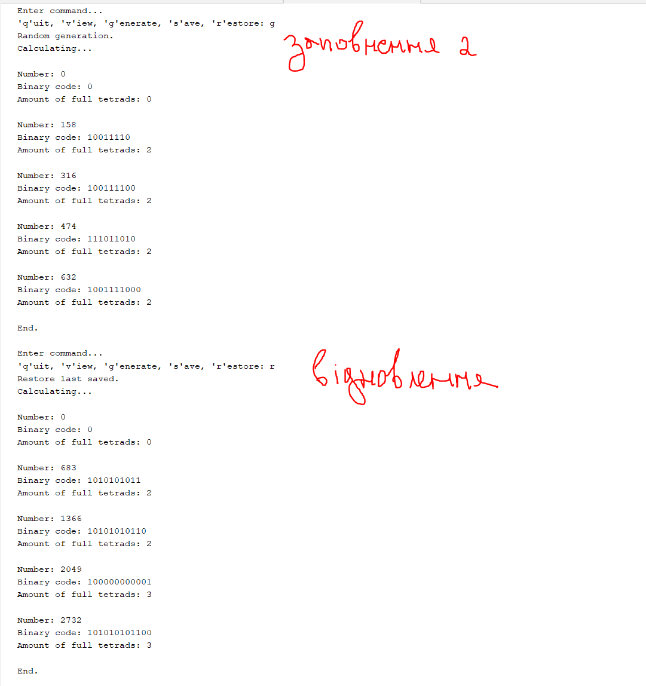
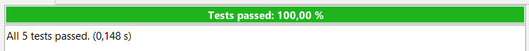
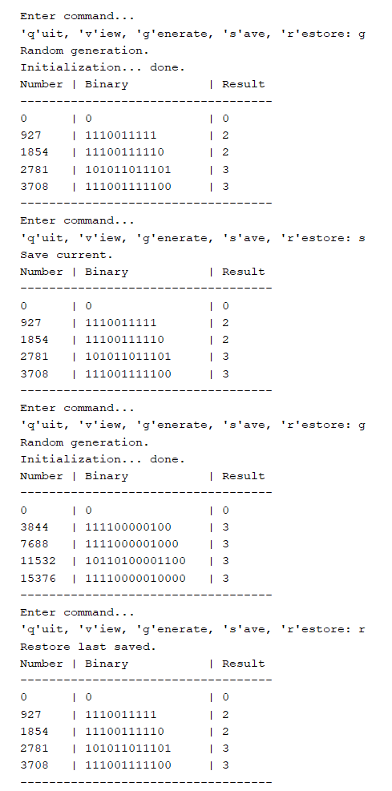
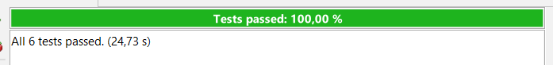
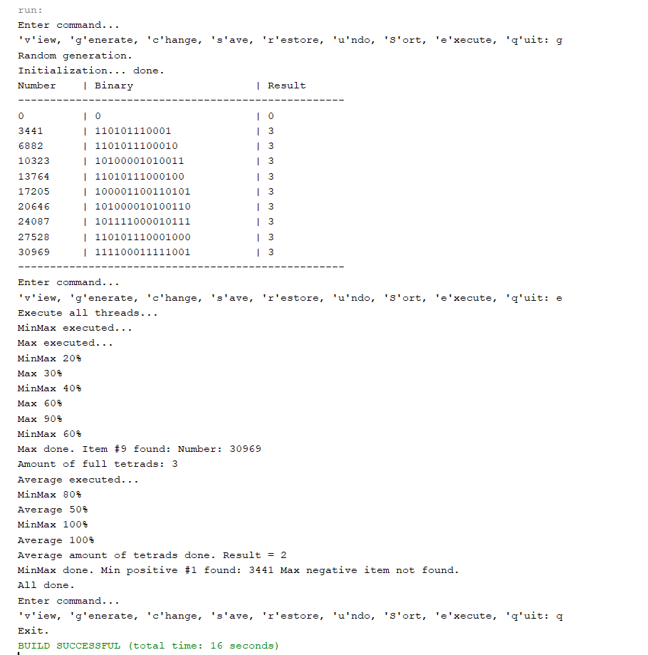

# Практика ООП
Зміст:
- [Завдання 1](#завдання-1)
- [Завдання 2](#завдання-2)
- [Завдання 3](#завдання-3)
- [Завдання 4](#завдання-4)
- [Завдання 5](#завдання-5)
- [Завдання 6](#завдання-6)

## Завдання 1 
(01.03.24)

- Створити репозиторій
- Написати просту консольну програму

```java
        System.out.println("Task 1\nEnter something in console: ");
        Scanner scanner = new Scanner(System.in);
        String input = scanner.nextLine();
        System.out.println("Your input: " + input);
        scanner.close();
```

## Завдання 2
(04.03.24)

- Розробити клас, що серіалізується, для зберігання параметрів і результатів обчислень.
- Використовуючи агрегування, розробити клас для знаходження рішення задачі.

```java
package Task2;

import java.io.Serializable;

/**
 * Клас, що серіалізується, для зберігання параметрів і результатів обчислень
 * 
 * @author Киричок Софія
 */
public class Item2d implements Serializable{
    
    private static final long serialVersionUID = 1L;
    
    /**Аргумент обчислюваної функції */
    transient private int num;
    
    /**Результат обчислюваної функції */
    private int result;
    
    /**Ініціалізація {@linkplain Item2d#num}, стандартним значенням */
    public Item2d(){
        num = 0;
    }
    
    /**Встановлює значення аргументу функції
     * @param num значення для ініціалізації поля
     */
    public Item2d(int num){ 
        this.num = num;
    }

    /**Отримує значення {@linkplain Item2d#num}
     * @return num значення аргументу функції
     */
    public int getNum() {
        return num;
    }
    
    /**Встановлює значення {@linkplain Item2d#num}
     * @param num значення для ініціалізації поля
     */
    public void setNum(int num) {
        this.num = num;
    }
    
     /**Отримує значення {@linkplain Item2d#result}
     * @return result значення результату функції
     */
    public int getResult() {
        return result;
    }
    
     /**Встановлює значення {@linkplain Item2d#result}
     * @param result значення для ініціалізації поля
     */
    public void setResult(int result) {
        this.result = result;
    }
    
    /**
     * @return Повертає строку з значенням аргументу та результатом.
    **/
    @Override
    public String toString(){
        return "Number: " + num + "\nAmount of full tetrads: " + result;
    }
}
```

```java
package Task2;

import java.io.IOException;
import java.io.FileInputStream;
import java.io.FileOutputStream;
import java.io.ObjectInputStream;
import java.io.ObjectOutputStream;
/**
 * Клас для знаходження кількості повних тетрад в числі
 *
 * @author Софія Киричок
 */
public class Calc {

    /**Ім'я файлу, що використовується при серіалізації */
    private static final String FNAME = "Item2d.bin";
    
    /**Зберігає результати обчислень. Об'єкт класу {@linkplain Item2d} */
    private Item2d result;
    
    /**Ініціалізує {@linkplain Calc#result} */
    public Calc() {
        result = new Item2d();
    }
    
    /**Обраховує кількість повних тетрад
     * @param num - int значення, кількість повних тетрад в якому треба визначити
     * @return кількість повних тетрад в значенні
     */
    public int countTetrads(int num) {
        String binaryString = Integer.toBinaryString(num);
        System.out.println(binaryString);
        return binaryString.length() / 4;
    }
    
    /**Приймає нове значення num, призначає його об'єкту, призначає об'єкту новий результат (кількість тетрад)
     * @param num - int значення, кількість повних тетрад в якому треба визначити
     */
    public void init(int num){
        result.setNum(num);
        result.setResult(countTetrads(num));
    }
    
    /**Отримати значення */
    public Item2d getObject(){
        return result;
    }
    
    /**Встановити значення */
    public void setObject(Item2d result){
        this.result = result;
    }
    
    /**Виводить значення об'єкту */
    public void show(){
        System.out.println(result);
    }
    
    /**Зберігає {@linkplain Calc#result} в файлі {@linkplain Calc#FNAME}
     * @throws IOException
     */
    public void save() throws IOException {
        ObjectOutputStream os = new ObjectOutputStream(new FileOutputStream(FNAME));
        os.writeObject(result);
        os.flush();
        os.close();
    }
    
    /**Відновлює {@linkplain Calc#result} з файлу {@linkplain Calc#FNAME}
     * @throws Exception
     */
    public void restore() throws Exception {
        ObjectInputStream is = new ObjectInputStream(new FileInputStream(FNAME));
        result = (Item2d) is.readObject();
        is.close();
    }
}
```

- Розробити клас для демонстрації в діалоговому режимі збереження та відновлення стану об'єкта, використовуючи серіалізацію.
- Показати особливості використання transient полів. 

```java
package Task2;

import java.io.IOException;
import java.io.BufferedReader;
import java.io.InputStreamReader;
import java.util.Random;

/**
 * Виконує визначення та відображення результатів
 * 
 * @author Киричок Софія
 * @see Main#main
 */
public class Main {
    
    /**Об'єкт класу {@linkplain Calc} для обчислень*/
    private Calc calc = new Calc();
    
    /**Об'єкт класу {@linkplain Irem2d} для ініціалізації обчислюваних значень*/
    private Item2d item = new Item2d();
    
    /**Відображує меню*/
    private void menu() {
        String s = null;
        BufferedReader in = new BufferedReader(new InputStreamReader(System.in));
        do {
            do {
                System.out.println("Enter command...");
                System.out.print("'q'uit, 'v'iew, 'g'enerate, 's'ave, 'r'estore: ");
                try {
                    s = in.readLine();
                } catch (IOException e) {
                    System.out.println("Error: " + e);
                    System.exit(0);
                }
            } while (s.length() != 1);
            switch (s.charAt(0)) {
                case 'q':
                    System.out.println("Exit.");
                    break;
                case 'v':
                    System.out.println("View current.");
                    calc.show();
                    break;
                case 'g':
                    System.out.println("Generating new int number...");
                    Random random = new Random();
                    calc.init(random.nextInt(2501));
                    calc.show();
                    break;
                case 's':
                    System.out.println("Save current.");
                    try {
                        calc.save();
                    } catch (IOException e) {
                        System.out.println("Serialization error: " + e);
                    }
                    calc.show();
                    break;
                case 'r':
                    System.out.println("Restore last saved.");
                    try {
                        calc.restore();
                    } catch (Exception e) {
                        System.out.println("Serialization error: " + e);
                    }
                    calc.show();
                    break;
                default:
                    System.out.print("Wrong command. ");
            }
        } while (s.charAt(0) != 'q');
    }

    /**
     * Виконується при запуску програми
     * @param args the command line arguments
     */
    public static void main(String[] args) {

        Main main = new Main();
        main.menu();
    }
}
```

- Юніт тест (клас для тестування коректності результатів обчислень та серіалізації/десеріалізації)

```java
import Task2.Calc;

/**
 * Тестування коректності результатів обчислень та серіалізації/десеріалізації
 *
 * @author Киричок Софія
 */
public class MainTest implements Serializable {

    /**
     * Перевірка функціональності класу {@linkplain Calc}
     */
    @Test
    public void testCalc() {
        Calc calc = new Calc();
        assertEquals(0, calc.countTetrads(0));
        assertEquals(2, calc.countTetrads(1000));
        assertEquals(3, calc.countTetrads(3578));
    }

    /**
     * Перевірка серіалізації (коректність відновлення даних) 
     */
    @Test
    public void testRestore() {
        Calc calc = new Calc();
        Random random = new Random();
        int num, result;
        for (int ctr = 0; ctr < 1000; ctr++) {
            num = random.nextInt(2501);

            // Ініціалізуємо об'єкт calc з випадковим числом num
            calc.init(num);

            // Отримуємо результат ініціалізації
            result = calc.getObject().getResult();

            try {
                // Зберігаємо стан
                calc.save();
            } catch (IOException e) {
                fail("Failed to save state");
            }

            // Імітуємо зміну стану
            calc.init(random.nextInt(2501));

            try {
                // Відновлюємо стан
                calc.restore();
            } catch (Exception e) {
                fail("Failed to restore state");
            }

            // Перевірка, чи відновлені дані вірно
            assertEquals(result, calc.getObject().getResult());
        }
    }
}
```


## Завдання 3
(05.03.24)

- Як основа використовувати вихідний текст проекту попередньої лабораторної роботи. 
- Забезпечити розміщення результатів обчислень у колекції з можливістю збереження/відновлення.
- Використовуючи шаблон проектування Factory Method (Virtual Constructor), розробити ієрархію, <br>що передбачає розширення за рахунок додавання нових відображуваних класів.
- Розширити ієрархію інтерфейсом "фабрикованих" об'єктів, що представляє набір методів для відображення результатів обчислень.
- Реалізувати ці методи виведення результатів у текстовому виде.
- Розробити та реалізувати інтерфейс для "фабрикуючого" методу.

#### View.java

```java
package Task3;

import java.io.IOException;
/**
 * Product
 * Pattern Factory Method<br>
 * Інтерфейс фабрикуємих об'єктів. Оголошує методи відображення об'єктів
 * Оголошує методи відображення об'єктів
 * 
 * @author Киричок Софія
 */
public interface View {
    
    /**Відображення всього об'єкту*/
    public void viewShow();
    
    /**Показує заголовок*/
    public void viewHeader();
    
    /**Показує основну частину*/
    public void viewBody();
    
    /**Показує напис про закінчення*/
    public void viewFooter();
    
    /**Виконує ініціалізацію*/
    public void viewInit();
    
    /**Зберігає інформацію в файл*/
    public void viewSave() throws IOException;
    
    /**Відновлює раніше збережену інформацію*/
    public void viewRestore() throws Exception;
}
```

#### ViewResult.java

```java
package Task3;

import java.io.FileInputStream;
import java.io.FileOutputStream;
import java.io.IOException;
import java.io.ObjectInputStream;
import java.io.ObjectOutputStream;
import java.util.ArrayList;
import java.util.Random;
import Task2Classes.*;

/**
 *
 * @author Киричок Софія
 */
public class ViewResult implements View {

    /**
     * Ім'я файлу, що використовується при серіалізації
     */
    private static final String FNAME = "items.bin";

    /**
     * Визначає кількість значень для обрахування за замовчуванням
     */
    private static final int DEFAULT_NUM = 5;

    /**
     * Колекція аргументів та результатів обчислень
     */
    private ArrayList<Item2d> items = new ArrayList<Item2d>();

    /**
     * Викликає ViewResult з параметром DEFAULT_NUM
     */
    public ViewResult() {
        this(DEFAULT_NUM);
    }

    /**
     * Ініціалізує колекцію {@linkplain ViewResult#items}
     *
     * @param n кількість елементів
     */
    public ViewResult(int n) {
        for (int ctr = 0; ctr < n; ctr++) {
            items.add(new Item2d());
        }
    }

    /**
     * Отримати значення {@linkplain ViewResult#items}
     *
     * @return значення посилання на об'єкт {@linkplain ArrayList}
     */
    public ArrayList<Item2d> getItems() {
        return items;
    }

    /**
     * Обраховує кількість повних тетрад в двійковому числі
     *
     * @return int кількість повних тетрад
     */
    public int countTetrads(String binaryString) {

        return binaryString.length() / 4;
    }

    /**
     * Переводить десяткове чисто в двійкове
     *
     * @return String двійковий код числа
     */
    public String binaryCode(int num) {

        String binaryString = Integer.toBinaryString(num);
        return binaryString;
    }

    /**
     * Визначає значення функції, зберігає результат в колекції
     * {@linkplain ViewResult#items}
     *
     * @param stepNum крок збільшення аргументу
     */
    public void init(int stepNum) {
        int num = 0;
        for (Item2d item : items) {
            item.setNum(num);
            item.setResult(countTetrads(binaryCode(num)));
            num += stepNum;
        }
    }

    /**
     * Викликає init(int stepNum) з випадковим значенням аргументу
     */
    @Override
    public void viewInit() {
        Random random = new Random();
        init(random.nextInt(10000));
    }

    /**
     * Реалізація методу viewSave()
     */
    @Override
    public void viewSave() throws IOException {
        ObjectOutputStream os = new ObjectOutputStream(new FileOutputStream(FNAME));
        os.writeObject(items);
        os.flush();
        os.close();
    }

    /**
     * Реалізація методу viewRestore()
     */
    @SuppressWarnings("unchecked")
    @Override
    public void viewRestore() throws Exception {
        ObjectInputStream is = new ObjectInputStream(new FileInputStream(FNAME));
        items = (ArrayList<Item2d>) is.readObject();
        is.close();
    }

    /**
     * Реалізація методу viewHeader()
     */
    @Override
    public void viewHeader() {
        System.out.println("Calculating...");
    }

    /**
     * Реалізація методу viewBody()
     */
    @Override
    public void viewBody() {
        for (Item2d item : items) {
            System.out.println("\nNumber: " + item.getNum());
            System.out.println("Binary code: " + binaryCode(item.getNum()));
            System.out.println("Amount of full tetrads: " + item.getResult());
        }
    }

    /**
     * Реалізація методу viewFooter()
     */
    @Override
    public void viewFooter() {
        System.out.println("\nEnd.\n");
    }

    /**
     * Реалізація методу viewShow()
     */
    @Override
    public void viewShow() {
        viewHeader();
        viewBody();
        viewFooter();
    }
}
```

#### Viewable.java

```java
package Task3;

/**Creator
 * Pattern Factory Method<br>
 * Оголошує метод, "фабрикуючий" об'єкти
 *
 * @author Киричок Софія
 * @see Viewable#getView()
 */
public interface Viewable {

    /**Створює об'єкт реалізуючий {@linkplain View}
     * @return View 
     */
    public View getView();
}
```

#### ViewableResult.java

```java
package Task3;

/**ConcreteCreator
 * Pattern Factory Method<br>
 * Оголошує метод, "фабрикуючий" об'єкти
 * 
 * @author Киричок Софія
 */
public class ViewableResult implements Viewable {

    /**Створює відображуваний об'єкт {@linkplain ViewResult}*/
    @Override
    public View getView() {
        return new ViewResult();
    }
}
```

#### Main.java

```java
package Task3;

import java.io.IOException;
import java.io.BufferedReader;
import java.io.InputStreamReader;

/**
 * Виконує визначення та відображення результатів
 *
 * @author Киричок Софія
 * @see Main#main
 */
public class Main {

    /**
     * Об'єкт реалізуючий інтерфейс {@linkplain View};
     * обслуговує колекцію об'єктів {@linkplain ex01.Item2d}
     */
    private View view;

    /** Ініціалізує поле {@linkplain Main#view view}*/
    public Main(View view) {
        this.view = view;
    }

    /**
     * Відображує меню
     */
    private void menu() {
        String s = null;
        BufferedReader in = new BufferedReader(new InputStreamReader(System.in));
        do {
            do {
                System.out.println("Enter command...");
                System.out.print("'q'uit, 'v'iew, 'g'enerate, 's'ave, 'r'estore: ");
                try {
                    s = in.readLine();
                } catch (IOException e) {
                    System.out.println("Error: " + e);
                    System.exit(0);
                }
            } while (s.length() != 1);
            switch (s.charAt(0)) {
                case 'q':
                    System.out.println("Exit.");
                    break;
                case 'v':
                    System.out.println("View current.");
                    view.viewShow();
                    break;
                case 'g':
                    System.out.println("Random generation.");
                    view.viewInit();
                    view.viewShow();
                    break;
                case 's':
                    System.out.println("Save current.");
                    try {
                        view.viewSave();
                    } catch (IOException e) {
                        System.out.println("Serialization error: " + e);
                    }
                    view.viewShow();
                    break;
                case 'r':
                    System.out.println("Restore last saved.");
                    try {
                        view.viewRestore();
                    } catch (Exception e) {
                        System.out.println("Serialization error: " + e);
                    }
                    view.viewShow();
                    break;
                default:
                    System.out.println("Wrong command.");
            }
        } while (s.charAt(0) != 'q');
    }

    /**
     * Виконується при запуску програми
     *
     * @param args the command line arguments
     */
    public static void main(String[] args) {

        Main main = new Main(new ViewableResult().getView());
        main.menu();
    }
}
```

#### MainTest.java

```java
import java.io.Serializable;
import org.junit.Test;
import static org.junit.Assert.assertEquals;
import junit.framework.Assert;
import java.io.IOException;
import java.util.Random;
import Task3.ViewResult;

/**
 * Тестування коректності результатів обчислень та серіалізації/десеріалізації
 *
 * @author Киричок Софія
 */
public class MainTest implements Serializable {

    ViewResult view = new ViewResult(5);

    @Test
    public void testBinaryCode() {
        assertEquals("0", view.binaryCode(0));
        assertEquals("1", view.binaryCode(1));
        assertEquals("101", view.binaryCode(5));
        assertEquals("111111111", view.binaryCode(511));
        assertEquals("100000000000", view.binaryCode(2048));
    }
    
    /**Перевірка правильності обрахування повних тетрад*/
    @Test
    public void testCountTetrads() {
        assertEquals(1, view.countTetrads("1000"));
        assertEquals(1, view.countTetrads("1010101"));
        assertEquals(2, view.countTetrads("10001000"));
        assertEquals(3, view.countTetrads("100010001000"));
    }

    /**
     * Перевірка серіалізації (коректність відновлення даних)
     */
    @Test
    public void testRestore() {
        Random random = new Random();
        ViewResult view1 = new ViewResult(1000);
        ViewResult view2 = new ViewResult();

        view1.init(random.nextInt(10000));

        try {
            view1.viewSave();
        } catch (IOException e) {
            Assert.fail(e.getMessage());
        }

        try {
            view2.viewRestore();
        } catch (Exception e) {
            Assert.fail(e.getMessage());
        }

        assertEquals(view1.getItems().size(), view2.getItems().size());
    }
}
```

Результати тестування:


Робота програми:




## Завдання 4
(06.03.24)

### Main.java

```java
package Task4;

import Task3.View;

/**
 * Виконує визначення та відображення результатів
 *
 * @author Киричок Софія
 * @see Main#main
 */
public class Main extends Task3.Main {

    /**Ініціалізує поле {@linkplain ex02.Main#view view}*/
    public Main(View view) {
        super(view);
    }

    /**
     * Виконується при запуску програми
     *
     * @param args the command line arguments
     */
    public static void main(String[] args) {
        Main main = new Main(new ViewableTable().getView());
        main.menu();
    }
}
```

###  ViewableTable.java

```java
package Task4;

import Task3.ViewableResult;
import Task3.View;

/**
 * ConcreteCreator. Pattern Factory Method<br>
 * Оголошує метод, фабрикуючий об'єкти
 *
 * @author Киричок Софія
 * @see ViewableResult
 * @see ViewableTable#getView()
 */
public class ViewableTable extends ViewableResult {

    /**
     * Створює відображуваний об'єкт {@linkplain ViewTable}
     *
     * @return View
     */
    @Override
    public View getView() {
        return new ViewTable();
    }
}
```

###  ViewTable.java

```java
package Task4;

import java.util.Formatter;
import Task2.Item2d;
import Task3.ViewResult;

/**ConcreteProduct. Pattern Factory Method<br>
 * Виведення у вигляді таблиці 
 *
 * @author Киричок Софія
 */
public class ViewTable extends ViewResult {

    /**
     * Ширина таблиці за замовчуванням
     */
    private static final int DEFAULT_WIDTH = 35;

    /**
     * Ширина таблиці
     */
    private short width;

    /**
     * Встановлює {@linkplain ViewTable#width width} значенням
     * {@linkplain ViewTable#DEFAULT_WIDTH DEFAULT_WIDTH}<br>
     * Викликається конструктор суперкласу
     * {@linkplain ViewResult#ViewResult() ViewResult()}
     */
    public ViewTable() {
        width = DEFAULT_WIDTH;
    }

    /**
     * Встановлює {@linkplain ViewTable#width} значенням width Викликається
     * конструктор суперкласу {@linkplain ViewResult#ViewResult() ViewResult()}
     *
     * @param width ширина таблиці
     */
    public ViewTable(short width) {
        this.width = width;
    }

    /**
     * Встановлює {@linkplain ViewTable#width} значенням width Викликається
     * конструктор суперкласу {@linkplain ViewResult#ViewResult() ViewResult()}
     *
     * @param width ширина таблиці
     * @param n кількість елементів колекції; передається суперконструктору
     */
    public ViewTable(short width, int n) {
        super(n);
        this.width = width;
    }

    /**
     * Встановлює {@linkplain ViewTable#width} значенням width
     *
     * @param width нова ширина таблиці
     * @return задана ширина таблиці
     */
    public int setWidth(short width) {
        return this.width = width;
    }

    /**
     * Повертає значення ширини таблиці
     *
     * @return ширина таблиці
     */
    public int getWidth() {
        return width;
    }

    /**
     * Виводить горизонтальний розділювач для таблиці шириною
     * {@linkplain ViewTable#width} символів
     */
    private void outLine() {
        for (int i = width; i > 0; i--) {
            System.out.print('-');
        }
    }

    /**
     * Закінчує вивід розділювачем {@linkplain ViewTable#outLine()}
     *
     */
    private void outLineLn() {
        outLine();
        System.out.println();
    }

    /**
     * Виводить заголовок таблиці
     */
    private void outHeader() {
        Formatter fmt = new Formatter();
        int partWidth = (width - 3) / 2;
        fmt.format("%-" + (partWidth - 10) + "s | %-" + partWidth + "s | %s",
                "Number", "Binary", "Result");
        System.out.println(fmt.toString());
    }

    /**
     * Виводіть "тіло" таблиці символів
     */
    private void outBody() {

        int partWidth = (width - 3) / 2;
        for (Item2d item : getItems()) {
            Formatter fmt = new Formatter();
            fmt.format("%-" + (partWidth - 10) + "d | %-" + partWidth + "s | %s%n", item.getNum(), binaryCode(item.getNum()), item.getResult());
            System.out.printf(fmt.toString());
        }
    }

    /**
     * Перевантаження (overloading) методу суперкласу; визначає поле
     * {@linkplain ViewTable#width} значением width. Викликає метод
     * {@linkplain ViewResult#viewInit() viewInit()}
     *
     * @param width нова ширина таблиці
     */
    public final void init(short width) { // method overloading
        this.width = width;
        viewInit();

    }

    /**
     * Перевантаження (overloading) методу суперкласу; визначає поле
     * {@linkplain ViewTable#width} значением width. Для об'єкту
     * {@linkplain ViewTable} викликає метод
     * {@linkplain ViewTable#init(int stepNum)}
     *
     * @param width нова ширина таблиці
     * @param stepNum передається методу init(int)
     */
    public final void init(short width, int stepNum) { // method overloading
        this.width = width;
        init(stepNum);
    }

    /**
     * Перевизначення (overriding) методу суперкласу; виводить повідомлення про
     * виконання ініціалізації та викликає метод суперкласу.
     * {@linkplain ViewResult#init(int stepNum) init(int stepNum)}
     */
    @Override
    public void init(int stepNum) { // method overriding
        System.out.print("Initialization... ");
        super.init(stepNum);
        System.out.println("done. ");
    }

    /**
     * Вивід заголовка таблиці
     */
    @Override
    public void viewHeader() {
        outHeader();
        outLineLn();
    }

    /**
     * Вивід "тіла" таблиці
     */
    @Override
    public void viewBody() {
        outBody();
    }

    /**
     * Вивід кінця таблиці
     */
    @Override
    public void viewFooter() {
        outLineLn();
    }
}
```

###  MainTest.java

```java
import java.io.Serializable;
import org.junit.Test;
import static org.junit.Assert.assertEquals;
import junit.framework.Assert;
import java.io.IOException;
import java.util.Random;
import Task3.ViewResult;
import Task4.ViewTable;

/**
 * Тестування коректності результатів обчислень та серіалізації/десеріалізації
 *
 * @author Киричок Софія
 */
public class MainTest implements Serializable {

    ViewResult view = new ViewResult(5);

    /**
     * Перевірка правильності переведення десяткового числа в двійкове
     */
    @Test
    public void testBinaryCode() {
        assertEquals("0", view.binaryCode(0));
        assertEquals("1", view.binaryCode(1));
        assertEquals("101", view.binaryCode(5));
        assertEquals("111111111", view.binaryCode(511));
        assertEquals("100000000000", view.binaryCode(2048));
    }

    /**
     * Перевірка правильності обрахування повних тетрад
     */
    @Test
    public void testCountTetrads() {
        assertEquals(1, view.countTetrads("1000"));
        assertEquals(1, view.countTetrads("1010101"));
        assertEquals(2, view.countTetrads("10001000"));
        assertEquals(3, view.countTetrads("100010001000"));
    }

    @Test
    public void testTask4() {
        ViewTable tbl = new ViewTable((short) 15, 10);
        assertEquals(15, tbl.getWidth());
        assertEquals(10, tbl.getItems().size());
    }

    /**
     * Перевірка серіалізації (коректність відновлення даних)
     */
    @Test
    public void testRestoreT3() {
        Random random = new Random();
        ViewResult view1 = new ViewResult(1000);
        ViewResult view2 = new ViewResult();

        view1.init(random.nextInt(10000));

        try {
            view1.viewSave();
        } catch (IOException e) {
            Assert.fail(e.getMessage());
        }

        try {
            view2.viewRestore();
        } catch (Exception e) {
            Assert.fail(e.getMessage());
        }

        assertEquals(view1.getItems().size(), view2.getItems().size());
    }

    /**
     * Перевірка серіалізації (коректність відновлення даних)
     */
    @Test
    public void testRestoreT4() {
        Random random = new Random();
        ViewTable tbl1 = new ViewTable((short)10, 1000);
        ViewTable tbl2 = new ViewTable();

        tbl1.init(random.nextInt(5001));

        try {
            tbl1.viewSave();
        } catch (IOException e) {
            Assert.fail(e.getMessage());
        }

        try {
            tbl2.viewRestore();
        } catch (Exception e) {
            Assert.fail(e.getMessage());
        }

        assertEquals(tbl1.getItems().size(), tbl2.getItems().size());
    }
}
```

Результати тестування:



Робота програми:




## Завдання 5
(07.03.24)

```java
package Task5;

import Task3.View;
import Task4.ViewableTable;

/**Формує та відображає меню
 * Реалізує шаблон Singleton
 *
 * @author Sofiia Kyrychok
 */
public class Application {

    private static final Application instance = new Application();

    private Application() {}

    public static Application getInstance() {
        return instance;
    }

    private final View view = new ViewableTable().getView();

    private final Menu menu = new Menu();

    public void run() {
        menu.add(new ViewConsoleCommand(view));
        menu.add(new GenerateConsoleCommand(view));
        menu.add(new ChangeConsoleCommand(view));
        menu.add(new SaveConsoleCommand(view));
        menu.add(new RestoreConsoleCommand(view));
        menu.add(new UndoConsoleCommand(view));
        menu.add(new SortConsoleCommand(view));
        menu.execute();
    }
}
```

```java
package Task5;

import Task2.Item2d;
import Task3.View;
import Task3.ViewResult;
import java.util.Random;

/**Консольна команда, що виконує зміну значень елементів на випадковий здвиг
 *
 * @author Sofiia Kyrychok
 */
public class ChangeConsoleCommand
        extends ChangeItemCommand
        implements ConsoleCommand {

    private View view;

    public View getView() {
        return view;
    }

    public View setView(View view) {
        return this.view = view;
    }

    public ChangeConsoleCommand(View view) {
        this.view = view;
    }

    @Override
    public char getKey() {
        return 'c';
    }

    @Override
    public String toString() {
        return "'c'hange";
    }

    @Override
    public void execute() {
        Random random = new Random();

        System.out.println("Change item: scale factor " + setOffset(random.nextInt(20) + 1));
        for (Item2d item : ((ViewResult) view).getItems()) {
            if (item.getNum() > 950000) {
                System.out.println("Maximum numbers size reached.");
                break;
            } else {
                super.setItem(item);
                super.execute();
            }
        }
        view.viewShow();
    }
}
```

```java
package Task5;

import Task2.Item2d;
import Task3.ViewResult;

/**Консольна команда Change Item
 *
 * @author Sofiia Kyrychok
 */
public class ChangeItemCommand implements Command {

    private Item2d item;

    private int offset;

    public Item2d getItem() {
        return item;
    }

    public Item2d setItem(Item2d item) {
        return this.item = item;
    }

    public int setOffset(int offset) {
        return this.offset = offset;
    }

    public int getOffset() {
        return offset;
    }

    @Override
    public void execute() {
        ViewResult view = new ViewResult();
        item.setNum(item.getNum() * offset);
        item.setResult(view.countTetrads(view.binaryCode(item.getNum())));
    }
}

```

```java
package Task5;

import Task3.View;
/**Консольна команда Generate
 *
 * @author Sofiia Kyrychok
 */
public class GenerateConsoleCommand implements ConsoleCommand {
    
    private final View view;
    
    public GenerateConsoleCommand(View view){
        this.view = view;
    }
    
    @Override
    public char getKey(){
        return 'g';
    }
    
    @Override
    public String toString(){
        return "'g'enerate";
    }
    
    @Override
    public void execute(){
        System.out.println("Random generation.");
        view.viewInit();
        view.viewShow();
    }
}

```

```java
package Task5;

/**Pattern Command, Worker Thread
 *
 * @author Sofiia Kyrychok
 */
public interface Command {
    
    public void execute();
}
```

```java
package Task5;

/**Інтерфейс консольної команди
 * Pattern Command
 *
 * @author Sofiia Kyrychok
 */
public interface ConsoleCommand extends Command{
    
    public char getKey();
}
```

```java
package Task5;

import java.io.BufferedReader;
import java.io.IOException;
import java.io.InputStreamReader;
import java.util.ArrayList;
import java.util.List;

/**Макрокоманда Pattern Command <br>
 * Колекція об'єктів класу ConsoleCommand
 * @author Sofiia Kyrychok
 */
public class Menu implements Command {

    private List<ConsoleCommand> menu = new ArrayList<ConsoleCommand>();

    public ConsoleCommand add(ConsoleCommand command){
        menu.add(command);
        return command;
    }
    
    @Override
    public String toString(){
        String s = "Enter command...\n";
        for(ConsoleCommand c : menu){
            s += c + ", ";
        }
        s += "'q'uit: ";
        return s;
    }
    
    @Override
    public void execute() {
        String s = null;
        BufferedReader in = new BufferedReader(new InputStreamReader(System.in));
        menu:
        while (true) {
            do {
                System.out.print(this);
                try {
                    s = in.readLine();
                } catch (IOException e) {
                    System.err.println("Error: " + e);
                    System.exit(0);
                }
            } while (s.length() != 1);
            char key = s.charAt(0);
            if (key == 'q') {
                System.out.println("Exit.");
                break menu;
            }
            for (ConsoleCommand c : menu) {
                if (s.charAt(0) == c.getKey()) {
                    c.execute();
                    continue menu;
                }
            }
            System.out.println("Wrong command.");
            continue menu;
        }
    }
}

```

```java
package Task5;

/**Обчислення та відображення результатів
 * Містить реалізацію статичного методу main()
 *
 * @author Sofiia Kyrychok
 */
public class Main {
    
    public static void main(String[] args){
        Application app = Application.getInstance();
        app.run();
    }
}

```

```java
package Task5;

import Task3.View;

/**Консольна команда Restore
 *
 * @author Sofiia Kyrychok
 */
public class RestoreConsoleCommand implements ConsoleCommand {

    private View view;

    public RestoreConsoleCommand(View view) {
        this.view = view;
    }

    @Override
    public char getKey() {
        return 'r';
    }

    @Override
    public String toString() {
        return "'r'estore";
    }

    @Override
    public void execute() {
        System.out.println("Restore last saved.");
        try {
            view.viewRestore();
        } catch (Exception e) {
            System.err.println("Serialization error: " + e);
        }
        view.viewShow();
    }
}

```

```java
package Task5;

import java.io.IOException;
import Task3.View;

/**Консольна команда Save
 * @author Sofiia Kyrychok
 */
public class SaveConsoleCommand implements ConsoleCommand {

    private final View view;

    public SaveConsoleCommand(View view) {
        this.view = view;
    }

    @Override
    public char getKey() {
        return 's';
    }

    @Override
    public String toString() {
        return "'s'ave";
    }

    @Override
    public void execute() {
        System.out.println("Save current.");
        try {
            view.viewSave();
        } catch (IOException e) {
            System.err.println("Serialization error: " + e);
        }
        view.viewShow();
    }
}

```

```java
package Task5;

import Task2.Item2d;
import Task3.View;
import Task3.ViewResult;
import java.io.IOException;
import java.util.ArrayList;
import java.util.Collections;
import java.util.Comparator;
import java.util.logging.Level;
import java.util.logging.Logger;

/**Консольна команда Sort
 *
 * @author Sofiia Kyrychok
 */
public class SortConsoleCommand implements ConsoleCommand {

    private final View view;

    public SortConsoleCommand(View view) {
        this.view = view;
    }

    @Override
    public char getKey() {
        return 'S';
    }

    @Override
    public String toString() {
        return "'S'ort";
    }

    @Override
    public void execute() {

        UndoReserve un = new UndoReserve(view);
        try {
            un.write();
        } catch (IOException e) {
            System.out.println("Writing error: " + e);
        } catch (Exception ex) {
            Logger.getLogger(SortConsoleCommand.class.getName()).log(Level.SEVERE, null, ex);
        }
        ArrayList<Item2d> itemsList = ((ViewResult) view).getItems();
        Collections.sort(itemsList, Comparator.comparingDouble(Item2d::getNum));
        view.viewShow();
    }
}

```

```java
package Task5;

import Task3.View;
/**Консольна команда Undo 
 *
 * @author Sofiia Kyrychok
 */
public class UndoConsoleCommand implements ConsoleCommand {

    private final View view;
    
    public UndoConsoleCommand(View view) {
        this.view = view;
    }

    @Override
    public char getKey() {
        return 'u';
    }

    @Override
    public String toString() {
        return "'u'ndo";
    }

    @Override
    public void execute() {
        UndoReserve un = new UndoReserve(view);
        System.out.println("Undo last command.");
        try {
            un.undo();
        } catch (Exception e) {
            System.err.println("Serialization error: " + e);
        }
        view.viewShow();
    }
}

```

```java
package Task5;

import Task2.Item2d;
import Task3.View;
import Task3.ViewResult;
import java.util.ArrayList;
import java.io.FileInputStream;
import java.io.FileOutputStream;
import java.io.IOException;
import java.io.ObjectInputStream;
import java.io.ObjectOutputStream;

/**Виконує функціонал консольної команди Undo
 *
 * @author Sofiia Kyrychok
 */
public class UndoReserve {

    private static final String FNAME1 = "last.bin";
    private static final String FNAME2 = "back.bin";

    private ArrayList<Item2d> items;
    
    private View view;

    public UndoReserve(View view) {
        this.view = view;
    }
    

    public void write() throws IOException, Exception {

        items = ((ViewResult) view).getItems();
        reWrite();
        ObjectOutputStream os = new ObjectOutputStream(new FileOutputStream(FNAME1));
        os.writeObject(items);
        os.flush();
        os.close();
    }

    @SuppressWarnings("unchecked")
    public void reWrite() throws Exception {

        items = ((ViewResult) view).getItems();
        ObjectInputStream is = new ObjectInputStream(new FileInputStream(FNAME1));
        items = (ArrayList<Item2d>) is.readObject();
        is.close();

        ObjectOutputStream os = new ObjectOutputStream(new FileOutputStream(FNAME2));
        os.writeObject(items);
        os.flush();
        os.close();
    }

    @SuppressWarnings("unchecked")
    public void undo() throws Exception {
        try {
            ObjectInputStream is = new ObjectInputStream(new FileInputStream(FNAME2));
            items = (ArrayList<Item2d>) is.readObject();
            is.close();
        } catch (ClassNotFoundException ex) {
        }
    }
}

```

```java
package Task5;

import Task3.View;

/**Консольна команда View
 *
 * @author Sofiia Kyrychok
 */
public class ViewConsoleCommand implements ConsoleCommand {

    private final View view;

    public ViewConsoleCommand(View view) {
        this.view = view;
    }

    @Override
    public char getKey() {
        return 'v';
    }

    @Override
    public String toString() {
        return "'v'iew";
    }

    @Override
    public void execute() {
        System.out.println("View current.");
        view.viewShow();
    }
}

```

```java

import java.io.Serializable;
import org.junit.Test;
import static org.junit.Assert.assertEquals;
import junit.framework.Assert;
import java.io.IOException;
import java.util.Random;
import Task3.ViewResult;
import Task4.ViewTable;
import Task2.Item2d;
import Task5.ChangeItemCommand;
import Task5.ChangeConsoleCommand;

/**
 * Тестування коректності результатів обчислень та серіалізації/десеріалізації
 *
 * @author Киричок Софія
 */
public class MainTest implements Serializable {

    ViewResult view = new ViewResult(5);

    /**
     * Перевірка правильності переведення десяткового числа в двійкове
     */
    @Test
    public void testBinaryCode() {
        assertEquals("0", view.binaryCode(0));
        assertEquals("1", view.binaryCode(1));
        assertEquals("101", view.binaryCode(5));
        assertEquals("111111111", view.binaryCode(511));
        assertEquals("100000000000", view.binaryCode(2048));
    }

    /**
     * Перевірка правильності обрахування повних тетрад
     */
    @Test
    public void testCountTetrads() {
        assertEquals(1, view.countTetrads("1000"));
        assertEquals(1, view.countTetrads("1010101"));
        assertEquals(2, view.countTetrads("10001000"));
        assertEquals(3, view.countTetrads("100010001000"));
    }

    @Test
    public void testTask4() {
        ViewTable tbl = new ViewTable((short) 15, 10);
        assertEquals(15, tbl.getWidth());
        assertEquals(10, tbl.getItems().size());
    }

    /**
     * Перевірка серіалізації (коректність відновлення даних)
     */
    @Test
    public void testRestoreT3() {
        Random random = new Random();
        ViewResult view1 = new ViewResult(1000);
        ViewResult view2 = new ViewResult();

        view1.init(random.nextInt(10000));

        try {
            view1.viewSave();
        } catch (IOException e) {
            Assert.fail(e.getMessage());
        }

        try {
            view2.viewRestore();
        } catch (Exception e) {
            Assert.fail(e.getMessage());
        }

        assertEquals(view1.getItems().size(), view2.getItems().size());
    }

    /**
     * Перевірка серіалізації (коректність відновлення даних)
     */
    @Test
    public void testRestoreT4() {
        Random random = new Random();
        ViewTable tbl1 = new ViewTable((short) 10, 1000);
        ViewTable tbl2 = new ViewTable();

        tbl1.init(random.nextInt(5001));

        try {
            tbl1.viewSave();
        } catch (IOException e) {
            Assert.fail(e.getMessage());
        }

        try {
            tbl2.viewRestore();
        } catch (Exception e) {
            Assert.fail(e.getMessage());
        }

        assertEquals(tbl1.getItems().size(), tbl2.getItems().size());
    }

    /**
     * Перевірка здвигу чисел
     */
    @Test
    public void testExecute() {
        ChangeItemCommand cmd = new ChangeItemCommand();
        Random random = new Random();
        cmd.setItem(new Item2d());
        int num, offset;
        for (int ctr = 0; ctr < 1000; ctr++) {
            num = random.nextInt(5001);
            cmd.getItem().setNum(num);
            offset = random.nextInt(10);
            cmd.setOffset(offset);
            cmd.execute();

            assertEquals(num * offset, cmd.getItem().getNum());
        }
    }

    /**
     * Тест відображення і виклику {@linkplain ChangeConsoleCommand} 
     */
    @Test
    public void testChangeConsoleCommand() {
        ChangeConsoleCommand cmd = new ChangeConsoleCommand(new ViewResult());
        cmd.getView().viewInit();
        cmd.execute();
        assertEquals("'c'hange", cmd.toString());
        assertEquals('c', cmd.getKey());
    }
}
```

## Завдання 6
(08.03.24)

```java
package Task6;

import Task3.View;
import Task4.ViewableTable;
import Task5.ChangeConsoleCommand;
import Task5.GenerateConsoleCommand;
import Task5.Menu;
import Task5.RestoreConsoleCommand;
import Task5.SaveConsoleCommand;
import Task5.SortConsoleCommand;
import Task5.UndoConsoleCommand;
import Task5.ViewConsoleCommand;

/**Обчислення та відображення результатів
 *
 * @author Sofiia Kyrychok
 */
public class Main {

    /**
     * Об'єкт, реалізуючий інтерфейс {@linkplain View}; обслуговує колекцію
     * об'єктів {@linkplain Task2.Item2d};
     *
     *
     * Ініціалізуються за допомогою Factory Method
     */
    private View view = new ViewableTable().getView();
    /**
     * Об'єкт класу {@linkplain Menu}; макрокоманда (Pattern Command)
     */
    private Menu menu = new Menu();

    /**
     * Обробка команд користувача
     */
    public void run() {
        menu.add(new ViewConsoleCommand(view));
        menu.add(new GenerateConsoleCommand(view));
        menu.add(new ChangeConsoleCommand(view));
        menu.add(new SaveConsoleCommand(view));
        menu.add(new RestoreConsoleCommand(view));
        menu.add(new UndoConsoleCommand(view));
        menu.add(new SortConsoleCommand(view));
        menu.add(new ExecuteConsoleCommand(view));
        menu.execute();
    }

    /**
     * Виконується при запуску команди
     *
     * @param args the command line arguments
     */
    public static void main(String[] args) {
        Main main = new Main();
        main.run();
    }
}

```

```java
package Task6;

import java.util.concurrent.TimeUnit;
import Task3.View;
import Task3.ViewResult;
import Task5.ConsoleCommand;


/**
 * Консольна команда Execute all threads; Pattern Command
 *
 * @author Sofiia Kyrychok
 */
public class ExecuteConsoleCommand implements ConsoleCommand {

    /**
     * Об'єкт, реалізуючий інтерфейс {@linkplain View}; обслуговує колекцію
     * об'єктів {@linkplain Task2.Item2d};
     */
    private View view;

    /**
     * Повертає поле {@linkplain ExecuteConsoleCommand#view}
     *
     * @return значення {@linkplain ExecuteConsoleCommand#view}
     */
    public View getView() {
        return view;
    }

    /**
     * Встановлює поле {@linkplain ExecuteConsoleCommand#view}
     *
     * @param view значення для {@linkplain ExecuteConsoleCommand#view}
     * @return нове значение {@linkplain ExecuteConsoleCommand#view}
     */
    public View setView(View view) {
        return this.view = view;
    }

    /**
     * Ініціалізує поле {@linkplain ExecuteConsoleCommand#view}
     *
     * @param view об'єкт, реалізуючий {@linkplain View}
     */

public ExecuteConsoleCommand(View view) {
        this.view = view;
    }

    @Override
    public char getKey() {
        return 'e';
    }

    @Override
    public String toString() {
        return "'e'xecute";
    }

    @Override
    public void execute() {

        CommandQueue queue1 = new CommandQueue();
        CommandQueue queue2 = new CommandQueue();
        
        MaxCommand maxCommand = new MaxCommand((ViewResult) view);
        AvgCommand avgCommand = new AvgCommand((ViewResult) view);
        MinMaxCommand minMaxCommand = new MinMaxCommand((ViewResult) view);
        System.out.println("Execute all threads...");
        
        queue1.put(minMaxCommand);
        queue2.put(maxCommand);
        queue2.put(avgCommand);
        
        try {
            while (avgCommand.running()
                    || maxCommand.running()
                    || minMaxCommand.running()) {
                TimeUnit.MILLISECONDS.sleep(100);
            }
            
            queue1.shutdown();
            queue2.shutdown();

            TimeUnit.SECONDS.sleep(1);
        } catch (InterruptedException e) {
            System.err.println(e);
        }
        System.out.println("All done.");
    }
}

```

```java
package Task6;

import Task5.Command;

/**
 * Представляє методи для розміщення та вилучення задач обробником потоку;
 * Pattern Worker Thread
 *
 * @author Sofiia Kyrychok
 */
public interface Queue {

    /**
     * Додає нову задачу в чергу; Pattern Worker Thread
     *
     * @param cmd нова задача
     */
    void put(Command cmd);

    /**
     * Видаляє задачу з черги; Pattern Worker Thread
     *
     * @return видаляєма задача
     */
    Command take();
}

```

```java
package Task6;

import java.util.Vector;
import Task5.Command;

/**
 * Створює обробник потоку, виконуючого об'єкти  інтерфейсом Command;
 * Pattern Worker Thread
 *
 * @author Sofiia Kyrychok
 */
public class CommandQueue implements Queue {

    /**
     * Черга задач
     */
    private Vector<Command> tasks;
    /**
     * Прапорецт очікування
     */
    private boolean waiting;
    /**
     * Прапорець завершення
     */
    private boolean shutdown;

    /**
     * Встановлює прапорець завершення
     */
    public void shutdown() {
        shutdown = true;
    }

    /**
     * Ініціалізація {@linkplain CommandQueue#tasks}
     * {@linkplain CommandQueue#waiting}
     * {@linkplain CommandQueue#waiting}; створює поток для класу
     * {@linkplain CommandQueue.Worker}
     */
    public CommandQueue() {
        tasks = new Vector<Command>();
        waiting = false;
        new Thread(new Worker()).start();
    }

    @Override
    public void put(Command r) {
        tasks.add(r);
        if (waiting) {
            synchronized (this) {
                notifyAll();
            }
        }
    }

    @Override
    public Command take() {
        if (tasks.isEmpty()) {
            synchronized (this) {

                waiting = true;
                try {
                    wait();
                } catch (InterruptedException ie) {
                    waiting = false;
                }
            }
        }
        return (Command) tasks.remove(0);
    }

    /**
     * Обслуговує чергу задач; Pattern Worker Thread
     *
     * @see Runnable
     */
    private class Worker implements Runnable {

        /**
         * Вилучає з черги готові до виконання задачі; Pattern Worker Thread
         */
        @Override
        public void run() {
            while (!shutdown) {
                Command r = take();
                r.execute();
            }
        }
    }
}

```

```java
package Task6;

import java.util.concurrent.TimeUnit;
import Task3.ViewResult;
import Task5.Command;

/**
 * Задача, що використовується обробником потоку; Pattern Worker Thread
 *
 * @author Sofiia Kyrychok
 */
public class MaxCommand implements Command /*, Runnable */ {

    /**
     * Зберігає результат обробки колекції
     */
    private int result = -1;
    /**
     * Прапорець готовності результату
     */
    private int progress = 0;
    /**
     * Обслуговує колекцію об'єктів {@linkplain Task2.Item2d}
     */
    private ViewResult viewResult;

    /**
     * Повертає поле {@linkplain MaxCommand#viewResult}
     *
     * @return значення {@linkplain MaxCommand#viewResult}
     */
    public ViewResult getViewResult() {
        return viewResult;
    }

    /**
     * Встановлює поле {@linkplain MaxCommand#viewResult}
     *
     * @param viewResult значення для {@linkplain MaxCommand#viewResult}
     * @return нове значення {@linkplain MaxCommand#viewResult}
     */
    public ViewResult setViewResult(ViewResult viewResult) {
        return this.viewResult = viewResult;
    }

    /**
     * Ініціалізує поле {@linkplain MaxCommand#viewResult}
     *
     * @param viewResult об'єкт класу {@linkplain ViewResult}
     */
    public MaxCommand(ViewResult viewResult) {
        this.viewResult = viewResult;
    }

    /**
     * Повертає результат
     *
     * @return поле {@linkplain MaxCommand#result}
     */
    public int getResult() {
        return result;
    }

    /**
     * Перевіряє готовність результату
     *
     * @return false - якщо результат знайдено, інакше - true
     * @see MaxCommand#result
     */
    public boolean running() {
        return progress < 100;
    }

    /**
     * Використовується обробником потоку {@linkplain CommandQueue}; Pattern
     * Worker Thread
     */
    @Override
    public void execute() {
        progress = 0;
        System.out.println("Max executed...");
        int size = viewResult.getItems().size();
        result = 0;
        for (int idx = 1; idx < size; idx++) {
            if (viewResult.getItems().get(result).getResult()
                    <= viewResult.getItems().get(idx).getResult()) {
                result = idx;
            }
            progress = idx * 100 / size;

            if (idx % (size / 3) == 0) {
                System.out.println("Max " + progress + "%");
            }
            try {
                TimeUnit.MILLISECONDS.sleep(3000 / size);
            } catch (InterruptedException e) {
                System.err.println(e);
            }
        }
        System.out.println("Max done. Item #" + result + " found: " + viewResult.getItems().get(result));

        progress = 100;

    }
}

```

```java
package Task6;

import java.util.concurrent.TimeUnit;
import Task2.Item2d;
import Task3.ViewResult;
import Task5.Command;

/**
 * Задача, що використовується обробником потоку; Pattern Worker Thread
 *
 * @author Sofiia Kyrychok
 */
public class MinMaxCommand implements Command /*, Runnable */ {

    /**
     * Зберігає результат обробки колекції
     */
    private int resultMin = -1;
    /**
     * Зберігає результат обробки колекції
     */
    private int resultMax = -1;
    /**
     * Прапорець готовності результату
     */
    private int progress = 0;
    /**
     * Обслуговує колекцію об'єктів {@linkplain Task2.Item2d}
     */
    private ViewResult viewResult;

    /**
     * Повертає поле {@linkplain MinMaxCommand#viewResult}
     *
     * @return значення {@linkplain MinMaxCommand#viewResult}
     */
    public ViewResult getViewResult() {
        return viewResult;
    }

    /**
     * Встановлює поле {@linkplain MinMaxCommand#viewResult}
     *
     * @param viewResult значення для {@linkplain MinMaxCommand#viewResult}
     * @return нове значення {@linkplain MinMaxCommand#viewResult}
     */
    public ViewResult setViewResult(ViewResult viewResult) {
        return this.viewResult = viewResult;
    }

    /**
     * Ініціалізує поле {@linkplain MinMaxCommand#viewResult}
     *
     * @param viewResult об'єкт класу {@linkplain ViewResult}
     */
    public MinMaxCommand(ViewResult viewResult) {
        this.viewResult = viewResult;
    }

    /**
     * Повертає результат
     *
     * @return поле {@linkplain MinMaxCommand#resultMin}
     */
    public int getResultMin() {
        return resultMin;
    }

    /**
     * Повертає результат
     *
     * @return поле {@linkplain MinMaxCommand#resultMax}
     */
    public int getResultMax() {
        return resultMax;
    }

    /**
     * Перевіряє готовність результату
     *
     * @return false - якщо результат знайдено, інакше - true
     * @see MinMaxCommand#result
     */
    public boolean running() {
        return progress < 100;
    }

    /**
     * Використовується обробником потоку {@linkplain CommandQueue}; Pattern
     * Worker Thread
     */
    @Override
    public void execute() {
        progress = 0;

        System.out.println("MinMax executed...");
        int idx = 0, size = viewResult.getItems().size();
        for (Item2d item : viewResult.getItems()) {
            if (item.getNum() > 0) {
                if ((resultMax == -1) || (viewResult.getItems().get(resultMax).getNum() > item.getNum())) {
                    //resultMax = idx;
                }
                if ((resultMin == -1) || (viewResult.getItems().get(resultMin).getNum() > item.getNum())) {
                    resultMin = idx;
                }
            }

            idx++;
            progress = idx * 100 / size;

            if (idx % (size / 5) == 0) {
                System.out.println("MinMax " + progress + "%");
            }
            try {
                TimeUnit.MILLISECONDS.sleep(5000 / size);
            } catch (InterruptedException e) {
                System.err.println(e);
            }
        }

        System.out.print("MinMax done. ");

        if (resultMin > -1) {
            System.out.print("Min positive #" + resultMin + " found: " + viewResult.getItems().get(resultMin).getNum());
        } else {
            System.out.print("Min positive not found.");
        }
        if (resultMax > -1) {
            System.out.println(" Max negative #" + resultMax + " found: " + viewResult.getItems().get(resultMax).getNum());
        } else {
            System.out.println(" Max negative item not found.");
        }
        progress = 100;
    }
}

```

```java
package Task6;

import Task5.Command;
import Task3.ViewResult;
import Task2.Item2d;
import java.util.concurrent.TimeUnit;

/**
 * Задача, що використовується обробником потоку; Pattern Worker Thread
 *
 * @author Sofiia Kyrychok
 */
public class AvgCommand implements Command {

    /**
     * Зберігає результат обробки колекції
     */
    private int result = 0;
    /**
     * Прапорець готовності результату
     */
    private int progress = 0;
    /**
     * Обслуговує колекцію об'єктів {@linkplain Task2.Item2d}
     */
    private ViewResult viewResult;

    /**
     * Повертає поле {@linkplain AvgCommand#viewResult}
     *
     * @return значення {@linkplain AvgCommand#viewResult}
     */
    public ViewResult getViewResult() {
        return viewResult;
    }

    /**
     * Встановлює поле {@linkplain AvgCommand#viewResult}
     *
     * @param viewResult значення для {@linkplain AvgCommand#viewResult}
     * @return нове значення {@linkplain AvgCommand#viewResult}
     */
    public ViewResult setViewResult(ViewResult viewResult) {
        return this.viewResult = viewResult;
    }

    /**
     * Ініціалізує поле {@linkplain AvgCommand#viewResult}
     *
     * @param viewResult об'єкт класу {@linkplain ViewResult}
     */
    public AvgCommand(ViewResult viewResult) {
        this.viewResult = viewResult;
    }

    /**
     * Повертає результат
     *
     * @return поле {@linkplain AvgCommand#result}
     */
    public double getResult() {
        return result;
    }

    /**
     * Перевіряє готовність результату
     *
     * @return false - якщо результат знайдено, інакше - true
     * @see AvgCommand#result
     */
    public boolean running() {
        return progress < 100;
    }

    /**
     * Використовується обробником потоку {@linkplain CommandQueue}; Pattern
     * Worker Thread
     */
    @Override
    public void execute() {
        progress = 0;
        System.out.println("Average executed...");
        result = 0;
        int idx = 1, size = viewResult.getItems().size();
        for (Item2d item : viewResult.getItems()) {
            result += item.getResult();
            progress = idx * 100 / size;

            if (idx++ % (size / 2) == 0) {
                System.out.println("Average " + progress + "%");
            }
            try {
                TimeUnit.MILLISECONDS.sleep(2000 / size);
            } catch (InterruptedException e) {
                System.err.println(e);
            }
        }
        result /= size;
        System.out.println("Average amount of tetrads done. Result = " + result);

        progress = 100;
    }
}

```

```java
package Tests;

import static org.junit.Assert.*;
import java.util.concurrent.TimeUnit;
import org.junit.AfterClass;
import org.junit.BeforeClass;
import org.junit.Test;
import Task6.*;
import Task3.ViewResult;

/**
 * Тестування класів завдання 6
 *
 * @author Sofiia Kyrychok
 */
public class TestTask6 {

    private final static int N = 1000;
    private static ViewResult view = new ViewResult(N);
    private static MaxCommand max1 = new MaxCommand(view);
    private static MaxCommand max2 = new MaxCommand(view);

    private static AvgCommand avg1 = new AvgCommand(view);
    private static AvgCommand avg2 = new AvgCommand(view);
    private static MinMaxCommand min1 = new MinMaxCommand(view);
    private static MinMaxCommand min2 = new MinMaxCommand(view);
    private CommandQueue queue = new CommandQueue();

    @BeforeClass
    public static void setUpBeforeClass() {
        view.viewInit();
        assertEquals(N, view.getItems().size());
    }

    @AfterClass
    public static void tearDownAfterClass() {
        assertEquals(max1.getResult(), max2.getResult());
        assertEquals(avg1.getResult(), avg2.getResult(), .1e-10);
        assertEquals(min1.getResultMax(), min2.getResultMax());
        assertEquals(min1.getResultMin(), min2.getResultMin());
    }

    /**
     * Перевірка основної функціональності класу {@linkplain MaxCommand}
     */
    @Test
    public void testMax() {
        max1.execute();
        assertTrue(max1.getResult() > -1);
    }

    /**
     * Перевірка основної функціональності класу {@linkplain AvgCommand}
     */
    @Test
    public void testAvg() {
        avg1.execute();
        assertTrue(avg1.getResult() != 0.0);
    }

    /**
     * Перевірка основної функціональності класу {@linkplain MinMaxCommand}
     */
    @Test
    public void testMin() {
        min1.execute();
        assertTrue(min1.getResultMin() > -1);
    }

    /**
     * Перевірка основної функціональності класу {@linkplain CommandQueue} 
     * задачею {@linkplain MaxCommand}
     */
    @Test
    public void testMaxQueue() {
        queue.put(max2);
        try {
            while (max2.running()) {
                TimeUnit.MILLISECONDS.sleep(100);
            }
            queue.shutdown();
            TimeUnit.SECONDS.sleep(1);
        } catch (InterruptedException e) {
            fail(e.toString());
        }
    }

    /**
     * Перевірка основної функціональності класу {@linkplain CommandQueue} з
     * задачею {@linkplain AvgCommand}
     */
    @Test
    public void testAvgQueue() {
        queue.put(avg2);
        try {
            while (avg2.running()) {
                TimeUnit.MILLISECONDS.sleep(100);
            }
            queue.shutdown();
            TimeUnit.SECONDS.sleep(1);
        } catch (InterruptedException e) {
            fail(e.toString());
        }
    }

    /**
     * Перевірка основної функціональності класу {@linkplain CommandQueue} з
     * задачею {@linkplain MinMaxCommand}
     */
    @Test
    public void testMinQueue() {

        queue.put(min2);
        try {
            while (min2.running()) {

                TimeUnit.MILLISECONDS.sleep(100);
            }
            queue.shutdown();
            TimeUnit.SECONDS.sleep(1);
        } catch (InterruptedException e) {
            fail(e.toString());
        }
    }
}
```

Результати тестування:



Робота програми:

