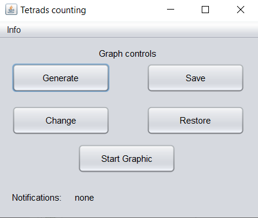
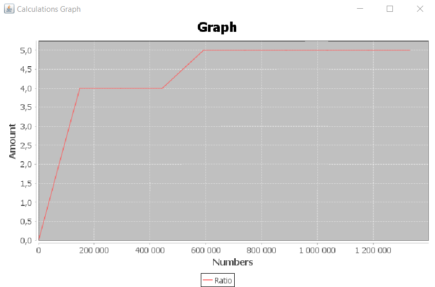

# Практика ООП
Посилання на код:
- [Завдання 2](src/Task2) (04.03.24)
- [Завдання 3](src/Task3) (05.03.24)
- [Завдання 4](src/Task4) (06.03.24)
- [Завдання 5](src/Task5) (07.03.24)
- [Завдання 6](src/Task6) (08.03.24)
- [Завдання 7](src/Task7) (до 20.03.24)
- [Меню та графік](src/Application) 

## Завдання 7 (Фінальне завдання)

<b>Для створення графіку було використано бібліотеку JFreeChart</b>

Робота програми:

Після виконання команди, в полі Notifications з'явиться "звіт" про виконану команду

## Зображення з минулих завдань:

