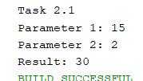
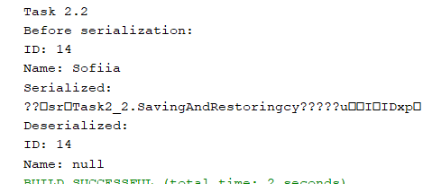
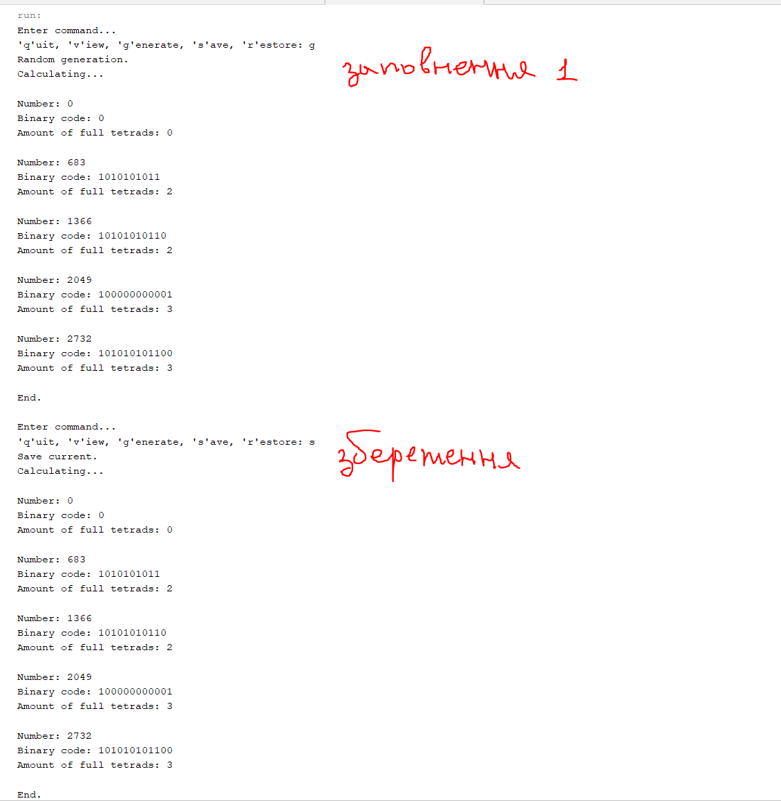

# Практика ООП

## Завдання 1 (01.03.24)

- Створити репозиторій
- Написати просту консольну програму

```java
        System.out.println("Task 1\nEnter something in console: ");
        Scanner scanner = new Scanner(System.in);
        String input = scanner.nextLine();
        System.out.println("Your input: " + input);
        scanner.close();
```

## Завдання 2 (04.03.24)

#### Завдання 2.1

- Розробити клас, що серіалізується, для зберігання параметрів і результатів обчислень.

```java
package Task2_1;

import java.io.Serializable;

/**
 * Клас, що серіалізується, для зберігання параметрів і результатів обчислень
 * 
 * @author Киричок Софія
 */
public class Parameters implements Serializable{

    private static final long serialVersionUID = 1L;
    private int param1;
    private int param2;
    private int result;
    
    public Parameters(int param1, int param2){
        this.param1 = param1;
        this.param2 = param2;
    }

    public int getParam1() {
        return param1;
    }

    public void setParam1(int param1) {
        this.param1 = param1;
    }

    public int getParam2() {
        return param2;
    }

    public void setParam2(int param2) {
        this.param2 = param2;
    }

    public int getResult() {
        return result;
    }

    public void setResult(int result) {
        this.result = result;
    }
    
    /**
     * @return Повертає строку з значеннями параметрів та результатом.
    **/
    @Override
    public String toString(){
        return "Parameter 1: " + param1 + "\nParameter 2: " + param2 + "\nResult: " + result;
    }
}
```
 
- Використовуючи агрегування, розробити клас для знаходження рішення задачі.

```java
package Task2_1;

/**
 * Клас для знаходження рішення задачі з використанням агрегування
 * 
 * @author Софія Киричок
 */
public class Calculating {
    
    private final Parameters parameters;
    
    public Calculating(Parameters parameters){
        this.parameters = parameters;
    }
    /**
     * Обчислює добуток параметрів та призначає це значення змінній result класу Parameters
     */
    public void calculate(){
        int result = parameters.getParam1() * parameters.getParam2();
        parameters.setResult(result);
    }
}
```

Робота коду:
```java
        System.out.println("Task 2.1");
        Parameters params = new Parameters(15, 2);
        Calculating calc = new Calculating(params);
        calc.calculate();
        String str = params.toString();
        System.out.println(str);
```



#### Завдання 2.2

- Розробити клас для демонстрації в діалоговому режимі збереження та відновлення стану об'єкта, використовуючи серіалізацію.
- Показати особливості використання transient полів. 

```java
package Task2_2;

import java.io.*;

/**
 * Розробити клас для демонстрації в діалоговому режимі збереження та
 * відновлення стану об'єкта, використовуючи серіалізацію. Показати особливості
 * використання transient полів.
 *
 * @author Киричок Софія
 */
public class SavingAndRestoring implements Serializable {

    private int ID;
    transient private String name;

    public SavingAndRestoring(int ID, String name) {
        this.ID = ID;
        this.name = name;
    }

    public int getID() {
        return ID;
    }

    public void setID(int ID) {
        this.ID = ID;
    }

    public String getName() {
        return name;
    }

    public void setName(String name) {
        this.name = name;
    }

    public void SerAndDeser() {
        try {
            ByteArrayOutputStream byteArrayOutputStream = new ByteArrayOutputStream();
            ObjectOutputStream out = new ObjectOutputStream(byteArrayOutputStream);
            out.writeObject(this);
            out.close();
            System.out.println("Serialized:\n" + byteArrayOutputStream.toString());

            ByteArrayInputStream byteArrayInputStream = new ByteArrayInputStream(byteArrayOutputStream.toByteArray());
            ObjectInputStream in = new ObjectInputStream(byteArrayInputStream);
            SavingAndRestoring newObject = (SavingAndRestoring) in.readObject();
            in.close();
            System.out.println("Deserialized:\n" + newObject.toString());

            byteArrayOutputStream.close();
            byteArrayInputStream.close();
        } catch (IOException | ClassNotFoundException e) {
            e.printStackTrace();
        }
    }

    @Override
    public String toString() {
        return "ID: " + ID + "\nName: " + name;
    }
}
```

Робота коду:

```java
        System.out.println("Task 2.2");
        
        SavingAndRestoring object = new SavingAndRestoring(14, "Sofiia");
        System.out.println("Before serialization:\n" + object.toString());
        
        object.SerAndDeser(); 
```



#### Завдання 2.4 (Варіант 11)

- Підрахувати кількість повних тетрад у двійковому поданні заданого десяткового числа.
- Тетрада (інформатика) — група з чотирьох послідовних бітів у двійковому запису числа: половина октету, один розряд двійково-десяткового коду

```java
package Task2_4;

/**
 * Підрахування кількості повних тетрад у двійковому поданні заданого десяткового числа.
 * 
 * @author Киричок Софія
 */
public class Tetrads {
    private float number;
    
    public Tetrads(float number){
        this.number = number;
    }

    public float getNumber() {
        return number;
    }

    public void setNumber(float number) {
        this.number = number;
    }
    
    public void countTetrads(){
        int intNumBits = Float.floatToIntBits(number);
        String binaryString = Integer.toBinaryString(intNumBits);
        int tetradaCount = binaryString.length() / 4;
        System.out.println("Binary code " + number + ": " + binaryString + ". Amount of full tetrads: " + tetradaCount);
    }
}
```

Робота коду:

```java
        System.out.println("- Task 2.4 -");

        Tetrads tetr = new Tetrads(25.7f);
        tetr.countTetrads();
```

