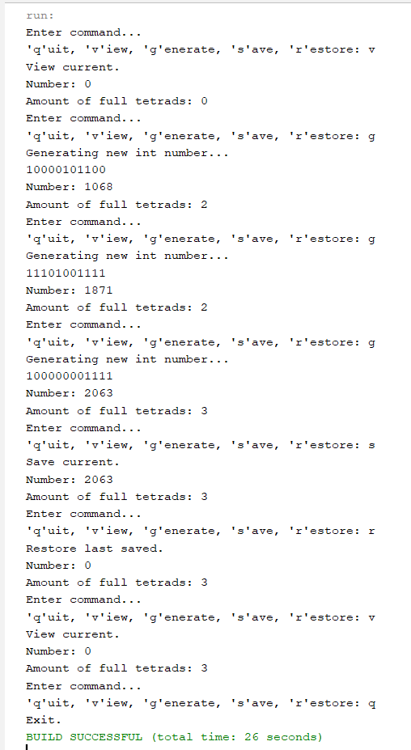
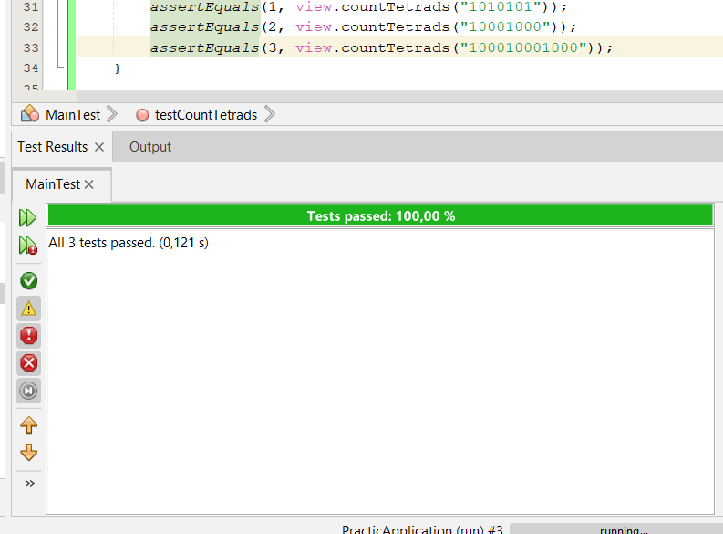

# Практика ООП

## Завдання 1 (01.03.24)

- Створити репозиторій
- Написати просту консольну програму

```java
        System.out.println("Task 1\nEnter something in console: ");
        Scanner scanner = new Scanner(System.in);
        String input = scanner.nextLine();
        System.out.println("Your input: " + input);
        scanner.close();
```

## Завдання 2 (04.03.24)

- Розробити клас, що серіалізується, для зберігання параметрів і результатів обчислень.
- Використовуючи агрегування, розробити клас для знаходження рішення задачі.

```java
package Task2;

import java.io.Serializable;

/**
 * Клас, що серіалізується, для зберігання параметрів і результатів обчислень
 * 
 * @author Киричок Софія
 */
public class Item2d implements Serializable{
    
    private static final long serialVersionUID = 1L;
    
    /**Аргумент обчислюваної функції */
    transient private int num;
    
    /**Результат обчислюваної функції */
    private int result;
    
    /**Ініціалізація {@linkplain Item2d#num}, стандартним значенням */
    public Item2d(){
        num = 0;
    }
    
    /**Встановлює значення аргументу функції
     * @param num значення для ініціалізації поля
     */
    public Item2d(int num){ 
        this.num = num;
    }

    /**Отримує значення {@linkplain Item2d#num}
     * @return num значення аргументу функції
     */
    public int getNum() {
        return num;
    }
    
    /**Встановлює значення {@linkplain Item2d#num}
     * @param num значення для ініціалізації поля
     */
    public void setNum(int num) {
        this.num = num;
    }
    
     /**Отримує значення {@linkplain Item2d#result}
     * @return result значення результату функції
     */
    public int getResult() {
        return result;
    }
    
     /**Встановлює значення {@linkplain Item2d#result}
     * @param result значення для ініціалізації поля
     */
    public void setResult(int result) {
        this.result = result;
    }
    
    /**
     * @return Повертає строку з значенням аргументу та результатом.
    **/
    @Override
    public String toString(){
        return "Number: " + num + "\nAmount of full tetrads: " + result;
    }
}
```

```java
package Task2;

import java.io.IOException;
import java.io.FileInputStream;
import java.io.FileOutputStream;
import java.io.ObjectInputStream;
import java.io.ObjectOutputStream;
/**
 * Клас для знаходження кількості повних тетрад в числі
 *
 * @author Софія Киричок
 */
public class Calc {

    /**Ім'я файлу, що використовується при серіалізації */
    private static final String FNAME = "Item2d.bin";
    
    /**Зберігає результати обчислень. Об'єкт класу {@linkplain Item2d} */
    private Item2d result;
    
    /**Ініціалізує {@linkplain Calc#result} */
    public Calc() {
        result = new Item2d();
    }
    
    /**Обраховує кількість повних тетрад
     * @param num - int значення, кількість повних тетрад в якому треба визначити
     * @return кількість повних тетрад в значенні
     */
    public int countTetrads(int num) {
        String binaryString = Integer.toBinaryString(num);
        System.out.println(binaryString);
        return binaryString.length() / 4;
    }
    
    /**Приймає нове значення num, призначає його об'єкту, призначає об'єкту новий результат (кількість тетрад)
     * @param num - int значення, кількість повних тетрад в якому треба визначити
     */
    public void init(int num){
        result.setNum(num);
        result.setResult(countTetrads(num));
    }
    
    /**Отримати значення */
    public Item2d getObject(){
        return result;
    }
    
    /**Встановити значення */
    public void setObject(Item2d result){
        this.result = result;
    }
    
    /**Виводить значення об'єкту */
    public void show(){
        System.out.println(result);
    }
    
    /**Зберігає {@linkplain Calc#result} в файлі {@linkplain Calc#FNAME}
     * @throws IOException
     */
    public void save() throws IOException {
        ObjectOutputStream os = new ObjectOutputStream(new FileOutputStream(FNAME));
        os.writeObject(result);
        os.flush();
        os.close();
    }
    
    /**Відновлює {@linkplain Calc#result} з файлу {@linkplain Calc#FNAME}
     * @throws Exception
     */
    public void restore() throws Exception {
        ObjectInputStream is = new ObjectInputStream(new FileInputStream(FNAME));
        result = (Item2d) is.readObject();
        is.close();
    }
}
```

- Розробити клас для демонстрації в діалоговому режимі збереження та відновлення стану об'єкта, використовуючи серіалізацію.
- Показати особливості використання transient полів. 

```java
package Task2;

import java.io.IOException;
import java.io.BufferedReader;
import java.io.InputStreamReader;
import java.util.Random;

/**
 * Виконує визначення та відображення результатів
 * 
 * @author Киричок Софія
 * @see Main#main
 */
public class Main {
    
    /**Об'єкт класу {@linkplain Calc} для обчислень*/
    private Calc calc = new Calc();
    
    /**Об'єкт класу {@linkplain Irem2d} для ініціалізації обчислюваних значень*/
    private Item2d item = new Item2d();
    
    /**Відображує меню*/
    private void menu() {
        String s = null;
        BufferedReader in = new BufferedReader(new InputStreamReader(System.in));
        do {
            do {
                System.out.println("Enter command...");
                System.out.print("'q'uit, 'v'iew, 'g'enerate, 's'ave, 'r'estore: ");
                try {
                    s = in.readLine();
                } catch (IOException e) {
                    System.out.println("Error: " + e);
                    System.exit(0);
                }
            } while (s.length() != 1);
            switch (s.charAt(0)) {
                case 'q':
                    System.out.println("Exit.");
                    break;
                case 'v':
                    System.out.println("View current.");
                    calc.show();
                    break;
                case 'g':
                    System.out.println("Generating new int number...");
                    Random random = new Random();
                    calc.init(random.nextInt(2501));
                    calc.show();
                    break;
                case 's':
                    System.out.println("Save current.");
                    try {
                        calc.save();
                    } catch (IOException e) {
                        System.out.println("Serialization error: " + e);
                    }
                    calc.show();
                    break;
                case 'r':
                    System.out.println("Restore last saved.");
                    try {
                        calc.restore();
                    } catch (Exception e) {
                        System.out.println("Serialization error: " + e);
                    }
                    calc.show();
                    break;
                default:
                    System.out.print("Wrong command. ");
            }
        } while (s.charAt(0) != 'q');
    }

    /**
     * Виконується при запуску програми
     * @param args the command line arguments
     */
    public static void main(String[] args) {

        Main main = new Main();
        main.menu();
    }
}
```

- Юніт тест (клас для тестування коректності результатів обчислень та серіалізації/десеріалізації)

```java
import Task2.Calc;

/**
 * Тестування коректності результатів обчислень та серіалізації/десеріалізації
 *
 * @author Киричок Софія
 */
public class MainTest implements Serializable {

    /**
     * Перевірка функціональності класу {@linkplain Calc}
     */
    @Test
    public void testCalc() {
        Calc calc = new Calc();
        assertEquals(0, calc.countTetrads(0));
        assertEquals(2, calc.countTetrads(1000));
        assertEquals(3, calc.countTetrads(3578));
    }

    /**
     * Перевірка серіалізації (коректність відновлення даних) 
     */
    @Test
    public void testRestore() {
        Calc calc = new Calc();
        Random random = new Random();
        int num, result;
        for (int ctr = 0; ctr < 1000; ctr++) {
            num = random.nextInt(2501);

            // Ініціалізуємо об'єкт calc з випадковим числом num
            calc.init(num);

            // Отримуємо результат ініціалізації
            result = calc.getObject().getResult();

            try {
                // Зберігаємо стан
                calc.save();
            } catch (IOException e) {
                fail("Failed to save state");
            }

            // Імітуємо зміну стану
            calc.init(random.nextInt(2501));

            try {
                // Відновлюємо стан
                calc.restore();
            } catch (Exception e) {
                fail("Failed to restore state");
            }

            // Перевірка, чи відновлені дані вірно
            assertEquals(result, calc.getObject().getResult());
        }
    }
}
```


## Завдання 3 (05.03.24)

- Як основа використовувати вихідний текст проекту попередньої лабораторної роботи. 
- Забезпечити розміщення результатів обчислень у колекції з можливістю збереження/відновлення.
- Використовуючи шаблон проектування Factory Method (Virtual Constructor), розробити ієрархію, <br>що передбачає розширення за рахунок додавання нових відображуваних класів.
- Розширити ієрархію інтерфейсом "фабрикованих" об'єктів, що представляє набір методів для відображення результатів обчислень.
- Реалізувати ці методи виведення результатів у текстовому виде.
- Розробити та реалізувати інтерфейс для "фабрикуючого" методу.

#### View.java

```java
package Task3;

import java.io.IOException;
/**
 * Product
 * Pattern Factory Method<br>
 * Інтерфейс фабрикуємих об'єктів. Оголошує методи відображення об'єктів
 * Оголошує методи відображення об'єктів
 * 
 * @author Киричок Софія
 */
public interface View {
    
    /**Відображення всього об'єкту*/
    public void viewShow();
    
    /**Показує заголовок*/
    public void viewHeader();
    
    /**Показує основну частину*/
    public void viewBody();
    
    /**Показує напис про закінчення*/
    public void viewFooter();
    
    /**Виконує ініціалізацію*/
    public void viewInit();
    
    /**Зберігає інформацію в файл*/
    public void viewSave() throws IOException;
    
    /**Відновлює раніше збережену інформацію*/
    public void viewRestore() throws Exception;
}
```

#### ViewResult.java

```java
package Task3;

import java.io.FileInputStream;
import java.io.FileOutputStream;
import java.io.IOException;
import java.io.ObjectInputStream;
import java.io.ObjectOutputStream;
import java.util.ArrayList;
import java.util.Random;
import Task2Classes.*;

/**
 *
 * @author Киричок Софія
 */
public class ViewResult implements View {

    /**
     * Ім'я файлу, що використовується при серіалізації
     */
    private static final String FNAME = "items.bin";

    /**
     * Визначає кількість значень для обрахування за замовчуванням
     */
    private static final int DEFAULT_NUM = 5;

    /**
     * Колекція аргументів та результатів обчислень
     */
    private ArrayList<Item2d> items = new ArrayList<Item2d>();

    /**
     * Викликає ViewResult з параметром DEFAULT_NUM
     */
    public ViewResult() {
        this(DEFAULT_NUM);
    }

    /**
     * Ініціалізує колекцію {@linkplain ViewResult#items}
     *
     * @param n кількість елементів
     */
    public ViewResult(int n) {
        for (int ctr = 0; ctr < n; ctr++) {
            items.add(new Item2d());
        }
    }

    /**
     * Отримати значення {@linkplain ViewResult#items}
     *
     * @return значення посилання на об'єкт {@linkplain ArrayList}
     */
    public ArrayList<Item2d> getItems() {
        return items;
    }

    /**
     * Обраховує кількість повних тетрад в двійковому числі
     *
     * @return int кількість повних тетрад
     */
    public int countTetrads(String binaryString) {

        return binaryString.length() / 4;
    }

    /**
     * Переводить десяткове чисто в двійкове
     *
     * @return String двійковий код числа
     */
    public String binaryCode(int num) {

        String binaryString = Integer.toBinaryString(num);
        return binaryString;
    }

    /**
     * Визначає значення функції, зберігає результат в колекції
     * {@linkplain ViewResult#items}
     *
     * @param stepNum крок збільшення аргументу
     */
    public void init(int stepNum) {
        int num = 0;
        for (Item2d item : items) {
            item.setNum(num);
            item.setResult(countTetrads(binaryCode(num)));
            num += stepNum;
        }
    }

    /**
     * Викликає init(int stepNum) з випадковим значенням аргументу
     */
    @Override
    public void viewInit() {
        Random random = new Random();
        init(random.nextInt(10000));
    }

    /**
     * Реалізація методу viewSave()
     */
    @Override
    public void viewSave() throws IOException {
        ObjectOutputStream os = new ObjectOutputStream(new FileOutputStream(FNAME));
        os.writeObject(items);
        os.flush();
        os.close();
    }

    /**
     * Реалізація методу viewRestore()
     */
    @SuppressWarnings("unchecked")
    @Override
    public void viewRestore() throws Exception {
        ObjectInputStream is = new ObjectInputStream(new FileInputStream(FNAME));
        items = (ArrayList<Item2d>) is.readObject();
        is.close();
    }

    /**
     * Реалізація методу viewHeader()
     */
    @Override
    public void viewHeader() {
        System.out.println("Calculating...");
    }

    /**
     * Реалізація методу viewBody()
     */
    @Override
    public void viewBody() {
        for (Item2d item : items) {
            System.out.println("\nNumber: " + item.getNum());
            System.out.println("Binary code: " + binaryCode(item.getNum()));
            System.out.println("Amount of full tetrads: " + item.getResult());
        }
    }

    /**
     * Реалізація методу viewFooter()
     */
    @Override
    public void viewFooter() {
        System.out.println("\nEnd.\n");
    }

    /**
     * Реалізація методу viewShow()
     */
    @Override
    public void viewShow() {
        viewHeader();
        viewBody();
        viewFooter();
    }
}
```

#### Viewable.java

```java
package Task3;

/**Creator
 * Pattern Factory Method<br>
 * Оголошує метод, "фабрикуючий" об'єкти
 *
 * @author Киричок Софія
 * @see Viewable#getView()
 */
public interface Viewable {

    /**Створює об'єкт реалізуючий {@linkplain View}
     * @return View 
     */
    public View getView();
}
```

#### ViewableResult.java

```java
package Task3;

/**ConcreteCreator
 * Pattern Factory Method<br>
 * Оголошує метод, "фабрикуючий" об'єкти
 * 
 * @author Киричок Софія
 */
public class ViewableResult implements Viewable {

    /**Створює відображуваний об'єкт {@linkplain ViewResult}*/
    @Override
    public View getView() {
        return new ViewResult();
    }
}
```

#### Main.java

```java
package Task3;

import java.io.IOException;
import java.io.BufferedReader;
import java.io.InputStreamReader;

/**
 * Виконує визначення та відображення результатів
 *
 * @author Киричок Софія
 * @see Main#main
 */
public class Main {

    /**
     * Об'єкт реалізуючий інтерфейс {@linkplain View};
     * обслуговує колекцію об'єктів {@linkplain ex01.Item2d}
     */
    private View view;

    /** Ініціалізує поле {@linkplain Main#view view}*/
    public Main(View view) {
        this.view = view;
    }

    /**
     * Відображує меню
     */
    private void menu() {
        String s = null;
        BufferedReader in = new BufferedReader(new InputStreamReader(System.in));
        do {
            do {
                System.out.println("Enter command...");
                System.out.print("'q'uit, 'v'iew, 'g'enerate, 's'ave, 'r'estore: ");
                try {
                    s = in.readLine();
                } catch (IOException e) {
                    System.out.println("Error: " + e);
                    System.exit(0);
                }
            } while (s.length() != 1);
            switch (s.charAt(0)) {
                case 'q':
                    System.out.println("Exit.");
                    break;
                case 'v':
                    System.out.println("View current.");
                    view.viewShow();
                    break;
                case 'g':
                    System.out.println("Random generation.");
                    view.viewInit();
                    view.viewShow();
                    break;
                case 's':
                    System.out.println("Save current.");
                    try {
                        view.viewSave();
                    } catch (IOException e) {
                        System.out.println("Serialization error: " + e);
                    }
                    view.viewShow();
                    break;
                case 'r':
                    System.out.println("Restore last saved.");
                    try {
                        view.viewRestore();
                    } catch (Exception e) {
                        System.out.println("Serialization error: " + e);
                    }
                    view.viewShow();
                    break;
                default:
                    System.out.println("Wrong command.");
            }
        } while (s.charAt(0) != 'q');
    }

    /**
     * Виконується при запуску програми
     *
     * @param args the command line arguments
     */
    public static void main(String[] args) {

        Main main = new Main(new ViewableResult().getView());
        main.menu();
    }
}
```

#### MainTest.java

```java
import java.io.Serializable;
import org.junit.Test;
import static org.junit.Assert.assertEquals;
import junit.framework.Assert;
import java.io.IOException;
import java.util.Random;
import Task3.ViewResult;

/**
 * Тестування коректності результатів обчислень та серіалізації/десеріалізації
 *
 * @author Киричок Софія
 */
public class MainTest implements Serializable {

    ViewResult view = new ViewResult(5);

    @Test
    public void testBinaryCode() {
        assertEquals("0", view.binaryCode(0));
        assertEquals("1", view.binaryCode(1));
        assertEquals("101", view.binaryCode(5));
        assertEquals("111111111", view.binaryCode(511));
        assertEquals("100000000000", view.binaryCode(2048));
    }
    
    /**Перевірка правильності обрахування повних тетрад*/
    @Test
    public void testCountTetrads() {
        assertEquals(1, view.countTetrads("1000"));
        assertEquals(1, view.countTetrads("1010101"));
        assertEquals(2, view.countTetrads("10001000"));
        assertEquals(3, view.countTetrads("100010001000"));
    }

    /**
     * Перевірка серіалізації (коректність відновлення даних)
     */
    @Test
    public void testRestore() {
        Random random = new Random();
        ViewResult view1 = new ViewResult(1000);
        ViewResult view2 = new ViewResult();

        view1.init(random.nextInt(10000));

        try {
            view1.viewSave();
        } catch (IOException e) {
            Assert.fail(e.getMessage());
        }

        try {
            view2.viewRestore();
        } catch (Exception e) {
            Assert.fail(e.getMessage());
        }

        assertEquals(view1.getItems().size(), view2.getItems().size());
    }
}
```

Результати тестування:



Робота програми:


